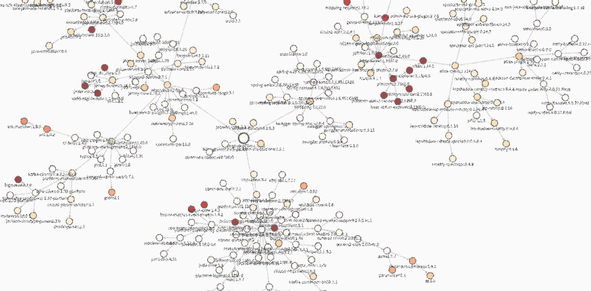
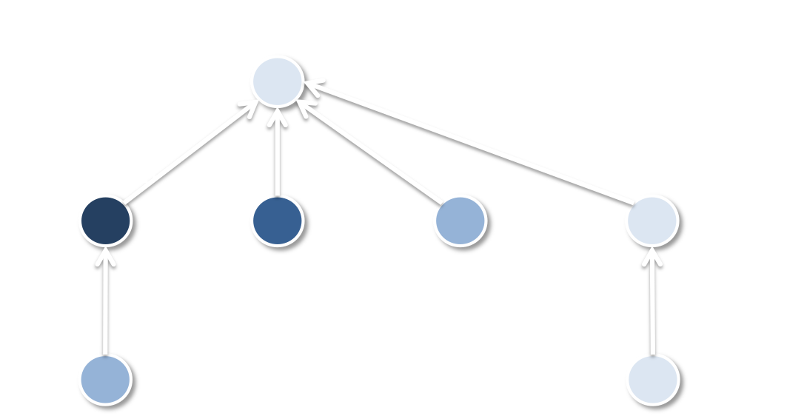
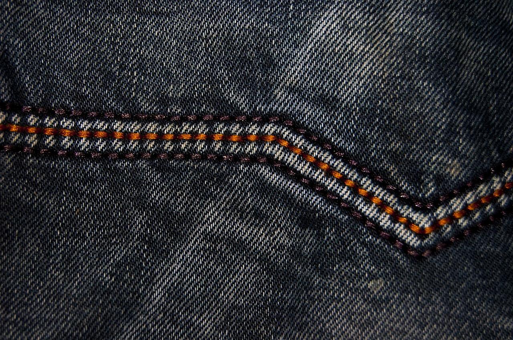
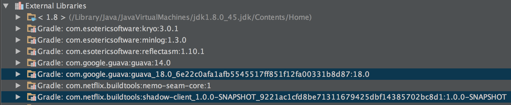

# Dependency Management at Netflix

### Dependency management in a vast microservice landscape

---

# Thin Services, Fat Clients



^ Fat clients are necessitated by fallback strategies, split business logic, remnants of the monolith

---

# Freedom and Responsibility

Responsible people **thrive** on freedom and are **worthy** of freedom


---

# The Binary Dependency Choice

In principle provides the most freedom of action per team

Each team selects a build tool that matches their style


^ Contrast this with Blaze, other general build from head models
^ Contrast this with monorepos -- understand the points here well: http://danluu.com/monorepo/

---

# Version Skew

How many versions am I behind the latest available version?

Skew leads to runtime execution paths that were **not unit tested**!

^ Skew comes from not building often or pinning to specific versions (either through locking or explicit version specification)
^ Different release cadences quickly lead to transitive skew




---

# Stability


Build repeatability

Don't make me change until I'm ready!

^ "Don't make me change..." -- because the cost of change can be so high with huge dependency graphs
^ http://pixabay.com/p-561491/?no_redirect

---

# Nebula Dependency Locking

Captures results of dependency resolution now so the same results can be reused later

```
./gradlew generateLock
./gradlew -PdependencyLock.useGeneratedLock=true test
./gradlew saveLock commitLock
```

---

# Nebula Dependency Locking

To force every project in a multimodule project to agree on dependency versions:

```
./gradlew generateGlobalLock
./gradlew -PdependencyLock.useGeneratedLock=true test
./gradlew saveGlobalLock
```

^ Can be handy currently in IntelliJ because of the limitations of the tooling API

---

# Avoidance


^ Avoid conflict resolution by limiting skew

---

# Adepthub

Uses a version compatibility matrix to calculate a **known** valid solution


^ Other claims - parallel downloads, git hash-based build repeatability
^ Problem with compat matrices is that nobody updates the metadata for old artifacts -- leads to no solutions
^ Sometimes an "invalid solution" is actually valid, but these results do not feed back into the metadata
^ BOTTOM LINE: dependency problems are NOT a metadata problem!

---

# Modularization

*Shading* involves package relocating dependencies makes them **globally unique**

Runtime modularization like OSGi and JBoss Modules are too constraining for us, work well in some contexts


^ Even across versions of the same artifact
^ Can result in unnecessary duplication -- when every library producer picks a different way to shade
^ https://www.flickr.com/photos/zscheyge/49012397

---

# Gradle Shadow Plugin

Requires action on the part of the dependency *producer*

```groovy
shadowJar {
  dependencies {
    include(dependency('com.google.guava:guava:18.0'))
  }
  relocate 'com.google', 'shaded.com.google'
}
```

(roughly equivalent to the Maven Shade Plugin)

^ Two stage process to shade: decide which transitives to shade, decide which package to relocate to

---

# Gradle Shadow Plugin

```java
public class NameAgeClient {
    Multimap<String, Integer> agesByName = HashMultimap.create();

    public void addAll(Multimap<String, Integer> agesByName) {
        this.agesByName.putAll(agesByName);
    }

    public Integer maxAge(String name) {
        return agesByName.get(name).stream().max(Integer::max).orElse(0);
    }
}
```

---

# Gradle Shadow Plugin

Shaded transitive dependencies are leaked to dependency consumer

```java
@Test public void demonstrateUnshadedSeam() {
    shaded.com.google.common.collect.Multimap<String, Integer> nameAges =
                HashMultimap.create();
    nameAges.put("jon", 10);

	NameAgeClient client = new NameAgeClient();
    client.addAll(nameAges);

    assertThat(client.maxAge("jon"), equalTo(10));
}
```

^ The good news is that the consumer is now free to depend on a different version of Guava for its own purposes


---

# Project Nemo

A **seam** exists at the points where your project interacts with the public API of its first order dependencies

The goal is for this seam to always refer to only your first-order dependencies



^ Like we just saw, sometimes this public API contains transitive dependencies

---

# Project Nemo

Just-in-time shading on the dependency *consumer* side


^ Currently under development

---

# Project Nemo

```groovy
repositories {
    maven { url 'https://nemo.netflix.com' }
}

dependencies {
    // appending _module causes JIT shading
    compile 'commons-configuration:commons-configuration_module:1.10'
}
```

---

# Project Nemo

Shaded artifacts are generated on the fly and differentiated by SHA1



---

# Project Nemo

Shaded transitive dependencies are no longer leaked

```java
@Test
public void demonstrateUnshadedSeam() {
    Multimap<String, Integer> nameAges = HashMultimap.create();
    nameAges.put("jon", 10);

    NameAgeClient client = new NameAgeClient();
    client.addAll(nameAges);

    assertThat(client.maxAge("jon"), equalTo(10));
}
```

^ The consumer uses the dependencies that they need

---

> Thanks!
-- we are hiring

